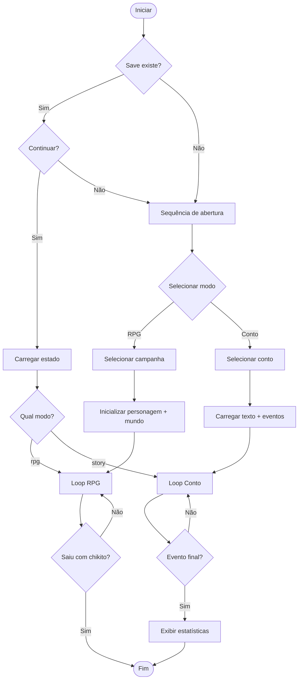
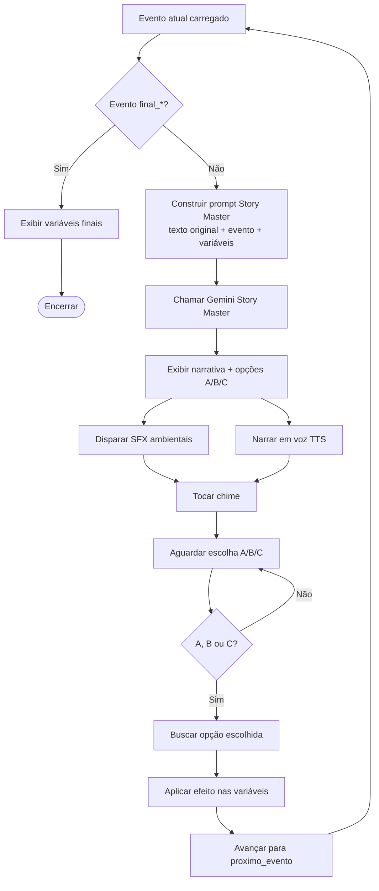
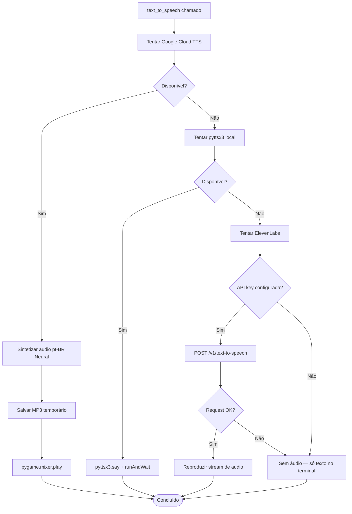

# Diagrama de Atividades

## 1. Atividade Principal — Sessão de Jogo



---

## 2. Atividade — Processamento de Ação RPG

```mermaid
flowchart TD
    INPUT[Receber input do jogador] --> IS_CMD{É comando especial?}

    IS_CMD -->|inventario| SHOW_INV[Exibir inventário]
    IS_CMD -->|status/vida| SHOW_HP[Exibir HP]
    IS_CMD -->|chikito| SAVE_EXIT[Salvar e sair]
    IS_CMD -->|Não| EXTRACT[Extrair objetos da ação]

    SHOW_INV --> INPUT
    SHOW_HP --> INPUT
    SAVE_EXIT --> END([Fim])

    EXTRACT --> VALIDATE{Todos objetos<br/>estão na cena?}

    VALIDATE -->|Não| ERR[Exibir erro amigável]
    ERR --> INPUT

    VALIDATE -->|Sim| TRIGGER{Calcular P gatilho<br/>P = 0.3 + rounds×0.1}

    TRIGGER -->|random() < P| FIRE_TRIGGER[Adicionar gatilho ao prompt]
    TRIGGER -->|Não disparou| BUILD_PROMPT[Construir prompt]

    FIRE_TRIGGER --> MOVE_TRIGGER[Mover gatilho para usados]
    MOVE_TRIGGER --> NEXT_TRIGGER[Ativar próximo na cadeia]
    NEXT_TRIGGER --> RESET_COUNTER[rodadas_sem_gatilho = 0]
    RESET_COUNTER --> BUILD_PROMPT

    BUILD_PROMPT --> CALL_GEMINI[Chamar Gemini Mestre]

    CALL_GEMINI --> PARSE[Parsear resposta]

    PARSE --> HAS_STATUS{[STATUS_UPDATE]?}
    HAS_STATUS -->|Sim| UPDATE_HP[Atualizar HP]
    HAS_STATUS -->|Não| HAS_INV{[INVENTORY_UPDATE]?}
    UPDATE_HP --> HAS_INV

    HAS_INV -->|Sim| UPDATE_INV[Atualizar inventário]
    HAS_INV -->|Não| AUDIO

    UPDATE_INV --> AUDIO

    AUDIO --> PLAY_SFX[Disparar SFX contextuais]
    AUDIO --> NARRATE[Narrar em voz TTS]

    PLAY_SFX --> ARCHIVISTA[Chamar Gemini Archivista]
    NARRATE --> ARCHIVISTA

    ARCHIVISTA --> UPDATE_STATE[Atualizar world_state]
    UPDATE_STATE --> INC_COUNTER[Incrementar rodadas_sem_gatilho]
    INC_COUNTER --> SAVE[Salvar estado em JSON]
    SAVE --> CHIME[Tocar chime]
    CHIME --> INPUT
```

---

## 3. Atividade — Conto Interativo



---

## 4. Atividade — Sistema TTS



---

## 5. Atividade — Validação de Ações do Jogador

```mermaid
flowchart TD
    ACTION[Ação recebida: "Pego a espada na mesa"] --> TOKENIZE[Tokenizar string<br/>por espaços/split]

    TOKENIZE --> FILTER_STOP[Remover stop words<br/>artigos, preposições, verbos comuns]

    FILTER_STOP --> EXTRACT_NOUNS[Extrair substantivos candidatos<br/>espada, mesa, corvo, porta...]

    EXTRACT_NOUNS --> CHECK_SCENE[Verificar cada objeto<br/>em interactable_elements_in_scene]

    CHECK_SCENE --> ALL_FOUND{Todos encontrados?}

    ALL_FOUND -->|Sim| VALID[Ação VÁLIDA — prosseguir]

    ALL_FOUND -->|Não| FIND_MISSING[Listar objetos não encontrados]

    FIND_MISSING --> BUILD_ERROR[Construir mensagem de erro:<br/>"X não está presente. Você vê: [cena atual]"]

    BUILD_ERROR --> SHOW_ERROR[Exibir para jogador]
    SHOW_ERROR --> RETRY[Aguardar nova ação]
```
