# Diagrama de Classes

## Diagrama Completo (Mermaid)

```mermaid
classDiagram
    class WorldState {
        +PlayerCharacter player_character
        +WorldData world_state
        +str game_mode
        +int rodadas_sem_gatilho
        +save() void
        +load() WorldState
    }

    class PlayerCharacter {
        +str name
        +str class_name
        +int current_act
        +Status status
        +int max_slots
        +List~str~ inventory
        +str desejo
        +get_used_slots() int
        +can_carry(item) bool
        +add_item(item) bool
        +remove_item(item) bool
    }

    class Status {
        +int hp
        +int max_hp
        +apply_damage(int) void
        +heal(int) void
        +is_alive() bool
    }

    class WorldData {
        +str current_location_key
        +str immediate_scene_description
        +dict active_quests
        +dict important_npcs_in_scene
        +List~str~ recent_events_summary
        +dict gatilhos_ativos
        +dict gatilhos_usados
        +List~str~ interactable_elements_in_scene
        +update_from_ai(response) void
    }

    class Campaign {
        +str id
        +str name
        +str description
        +CampaignFiles files
        +PlayerTemplate player_template
        +WorldTemplate world_template
        +load_npcs() dict
        +load_locations() dict
        +load_magic_items() dict
        +load_common_items() dict
        +load_narrative() str
    }

    class CampaignFiles {
        +str npcs
        +str itens_magicos
        +str itens_comuns
        +str locais
        +str campanha
    }

    class PlayerTemplate {
        +str class_name
        +int starting_hp
        +int max_slots
        +List~str~ starting_inventory
    }

    class WorldTemplate {
        +str initial_description
        +str initial_quest
        +str initial_location
        +dict initial_triggers
    }

    class NPC {
        +str nome
        +str aparencia_facil
        +str verdade_oculta
        +str papel
        +str localizacao_ato1
        +str localizacao_ato2
        +str localizacao_ato3
    }

    class Location {
        +str key
        +str nome
        +str descricao
        +List~Trigger~ gatilhos
        +get_trigger(id) Trigger
        +get_active_triggers(used) List~Trigger~
    }

    class Trigger {
        +str id
        +str descricao
        +str sfx
        +str proximo_gatilho
        +calculate_probability(rounds) float
        +should_fire(rounds) bool
    }

    class Item {
        +str nome
        +int slots
        +str descricao
        +str efeito
        +str como_obter
    }

    class MagicItem {
        +str raridade
    }

    class CommonItem {
        +bool consumivel
    }

    class InteractiveStory {
        +str nome
        +str texto_original
        +dict eventos
        +dict variaveis_dinamicas
        +load() void
        +get_evento(id) StoryEvent
    }

    class StoryEvent {
        +str id
        +str descricao_para_ia
        +List~StoryChoice~ opcoes
        +is_final() bool
    }

    class StoryChoice {
        +str texto
        +dict efeito
        +str proximo_evento
        +apply(variables) dict
    }

    class AudioManager {
        +str tts_provider
        +bool pygame_initialized
        +text_to_speech(text, voice) void
        +narrator_speech(text) void
        +master_speech(text) void
        +play_sfx(keyword) void
        +play_chime() void
        +speech_to_text() str
        +play_ressoar_opening_sequence() void
    }

    class GeminiClient {
        +str api_key
        +str model
        +float temperature
        +int max_tokens
        +generate(prompt) str
        +get_gm_narrative(world_state, action) str
        +get_story_master_narrative(story, event, vars) str
        +update_world_state(world_state, narrative) dict
    }

    class GameEngine {
        +WorldState current_state
        +Campaign active_campaign
        +AudioManager audio
        +GeminiClient ai
        +select_game_mode() str
        +new_game_loop() void
        +interactive_story_loop() void
        +validate_player_action(action) bool
        +extract_objects_from_action(action) List~str~
        +trigger_contextual_sfx(narrative) void
        +execute_command(cmd) void
    }

    WorldState "1" --> "1" PlayerCharacter
    WorldState "1" --> "1" WorldData
    PlayerCharacter "1" --> "1" Status
    Campaign "1" --> "1" CampaignFiles
    Campaign "1" --> "1" PlayerTemplate
    Campaign "1" --> "1" WorldTemplate
    Campaign "1" --> "*" NPC
    Campaign "1" --> "*" Location
    Campaign "1" --> "*" Item
    Location "1" --> "*" Trigger
    Item <|-- MagicItem
    Item <|-- CommonItem
    InteractiveStory "1" --> "*" StoryEvent
    StoryEvent "1" --> "*" StoryChoice
    GameEngine "1" --> "1" WorldState
    GameEngine "1" --> "1" Campaign
    GameEngine "1" --> "1" AudioManager
    GameEngine "1" --> "1" GeminiClient
    GameEngine "1" --> "*" InteractiveStory
```

---

## Classes Principais — Descrição Detalhada

### GameEngine (game.py)
Classe central que orquestra todo o sistema.

**Responsabilidades:**
- Inicializar os dois modos de jogo
- Executar os loops principais
- Delegar para AudioManager, GeminiClient, WorldState

**Métodos chave:**
- `new_game_loop()` — loop do RPG com validação de ações
- `interactive_story_loop()` — loop dos contos com escolhas
- `validate_player_action()` — verifica se ação é válida no contexto atual
- `extract_objects_from_action()` — extrai objetos do input do jogador
- `trigger_contextual_sfx()` — analisa narrativa e dispara sons

---

### WorldState + WorldData + PlayerCharacter (world_state_manager.py)
Representação completa do estado do jogo.

**Responsabilidades:**
- Serializar/deserializar estado para JSON
- Fornecer contexto para prompts da IA
- Manter histórico de eventos

---

### Campaign (campaign_manager.py)
Abstração para carregamento de conteúdo de campanha.

**Responsabilidades:**
- Ler arquivos JSON/MD das campanhas
- Fornecer template inicial do personagem
- Retornar dados de NPCs, locais, itens

---

### AudioManager (audio_manager.py)
Camada de abstração completa para todos os recursos de áudio.

**Responsabilidades:**
- TTS com cadeia de fallback
- Reprodução de SFX por keyword
- Captura de voz do jogador

---

### GeminiClient (embutido em game.py e world_state_manager.py)
Interface para a API Gemini com três personas especializadas.

| Persona       | Temperatura | Contexto                        | Output esperado          |
|---------------|-------------|----------------------------------|--------------------------|
| Mestre RPG    | 0.75        | WorldState + campanha + ação    | Narrativa open-world     |
| Mestre Contos | 0.75        | Texto original + evento + vars  | Narrativa + (A)(B)(C)    |
| Archivista    | 0.2         | WorldState + última narrativa   | JSON com estado atualizado|
