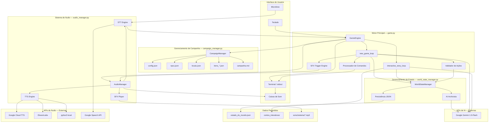

# Diagrama de Componentes

## Componentes do Sistema



---

## Diagrama de Dependências entre Módulos

```
game.py
  ├── audio_manager.py
  │     ├── google.cloud.texttospeech
  │     ├── pygame
  │     ├── speech_recognition
  │     ├── pyaudio
  │     ├── pyttsx3
  │     └── requests (ElevenLabs)
  │
  ├── world_state_manager.py
  │     ├── google.generativeai (Archivista)
  │     └── json (persistência)
  │
  ├── campaign_manager.py
  │     └── json (leitura de dados)
  │
  ├── google.generativeai (Mestre RPG + Mestre Contos)
  └── python-dotenv
```

---

## Diagrama de Deployment

```
┌────────────────────────────────────────────────────────────────────┐
│                    MÁQUINA LOCAL DO USUÁRIO                        │
│                                                                    │
│  ┌──────────────────────────────────────────────────────────────┐  │
│  │                    Python Runtime 3.8+                       │  │
│  │                                                              │  │
│  │  game.py ←──────────── audio_manager.py                     │  │
│  │    │                                                         │  │
│  │    ├── world_state_manager.py                                │  │
│  │    └── campaign_manager.py                                   │  │
│  │                                                              │  │
│  │  Arquivos de dados (JSON, TXT, MP3):                        │  │
│  │  campanhas/*, contos_interativos/*, sons/sistema/*           │  │
│  │  estado_do_mundo.json (save file)                            │  │
│  └──────────────────────────────────────────────────────────────┘  │
│                                                                    │
│  Hardware: Microfone, Caixas de Som, Teclado, Terminal             │
└──────────────────────────────┬─────────────────────────────────────┘
                               │ HTTPS
                               │
          ┌────────────────────┼─────────────────────┐
          │                    │                     │
          ▼                    ▼                     ▼
┌──────────────────┐  ┌────────────────┐  ┌──────────────────────┐
│  Google Gemini   │  │ Google Cloud   │  │    Google Speech     │
│  API             │  │ TTS API        │  │    Recognition API   │
│                  │  │                │  │                      │
│  generativelang  │  │  texttospeech  │  │  speech.googleapis   │
│  uage.googleapis │  │  .googleapis   │  │                      │
└──────────────────┘  └────────────────┘  └──────────────────────┘
```

---

## Componentes por Responsabilidade

| Componente               | Arquivo                    | Tipo        |
|--------------------------|----------------------------|-------------|
| Motor de Jogo            | `game.py`                  | Orquestrador|
| Sistema de Áudio         | `audio_manager.py`         | Serviço     |
| Gerenciador de Estado    | `world_state_manager.py`   | Repositório |
| Gerenciador de Campanha  | `campaign_manager.py`      | Repositório |
| IA Mestre RPG            | Gemini (via game.py)       | Externo     |
| IA Mestre Contos         | Gemini (via game.py)       | Externo     |
| IA Archivista            | Gemini (via WSM)           | Externo     |
| TTS Principal            | Google Cloud TTS           | Externo     |
| TTS Fallback             | pyttsx3                    | Local       |
| STT                      | Google Speech API          | Externo     |
| SFX Engine               | pygame.mixer               | Local       |
| Dados de Campanha        | `campanhas/*/`             | Dados       |
| Dados de Contos          | `contos_interativos/`      | Dados       |
| Efeitos Sonoros          | `sons/sistema/*.mp3`       | Dados       |
| Save do Jogo             | `estado_do_mundo.json`     | Dados       |
| Configuração             | `config.json`              | Configuração|
| Variáveis de Ambiente    | `.env`                     | Configuração|
