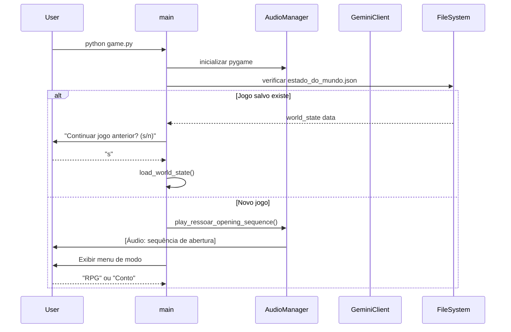
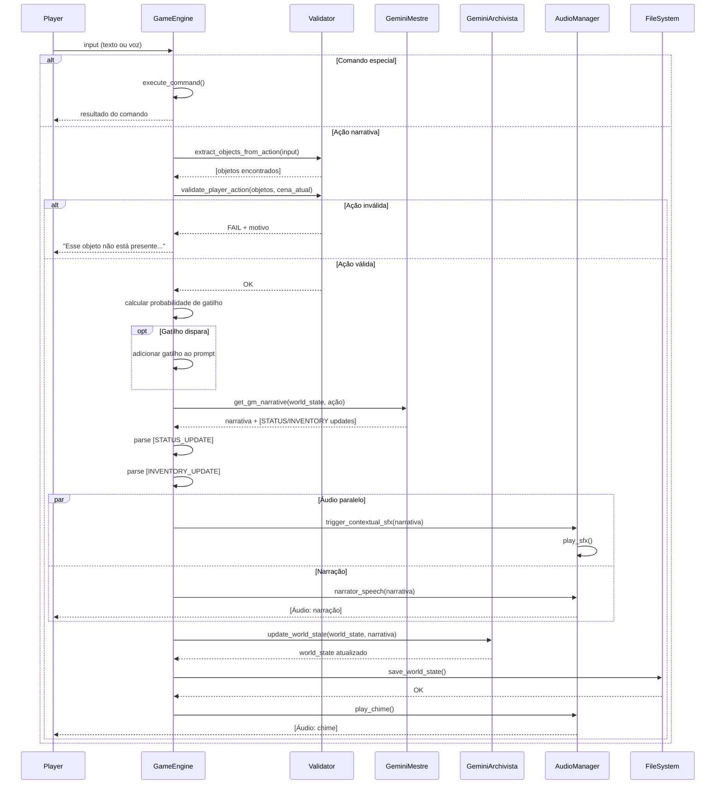
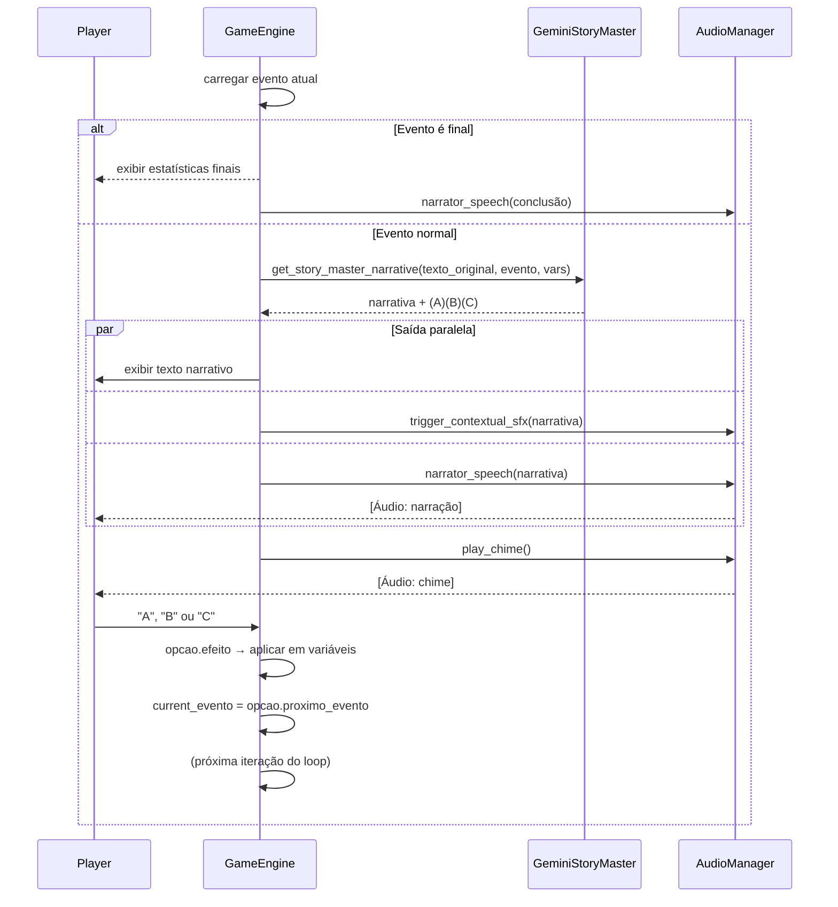
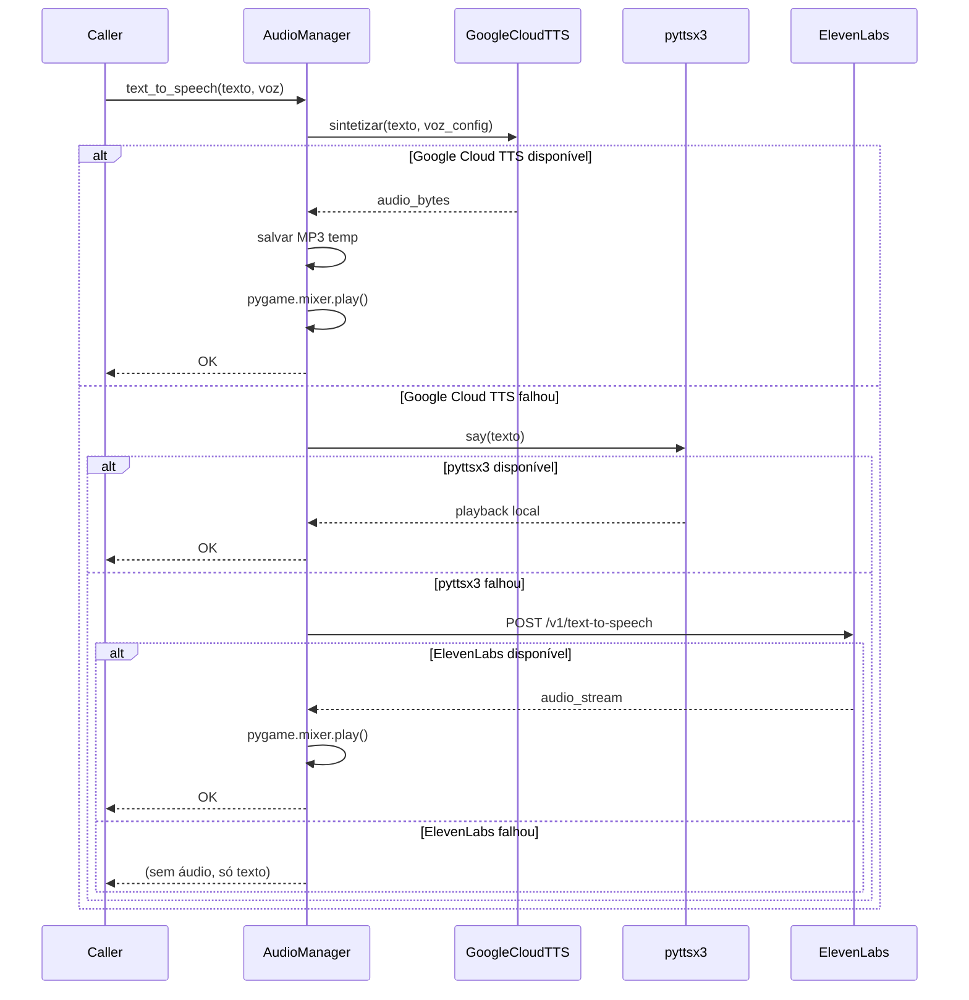
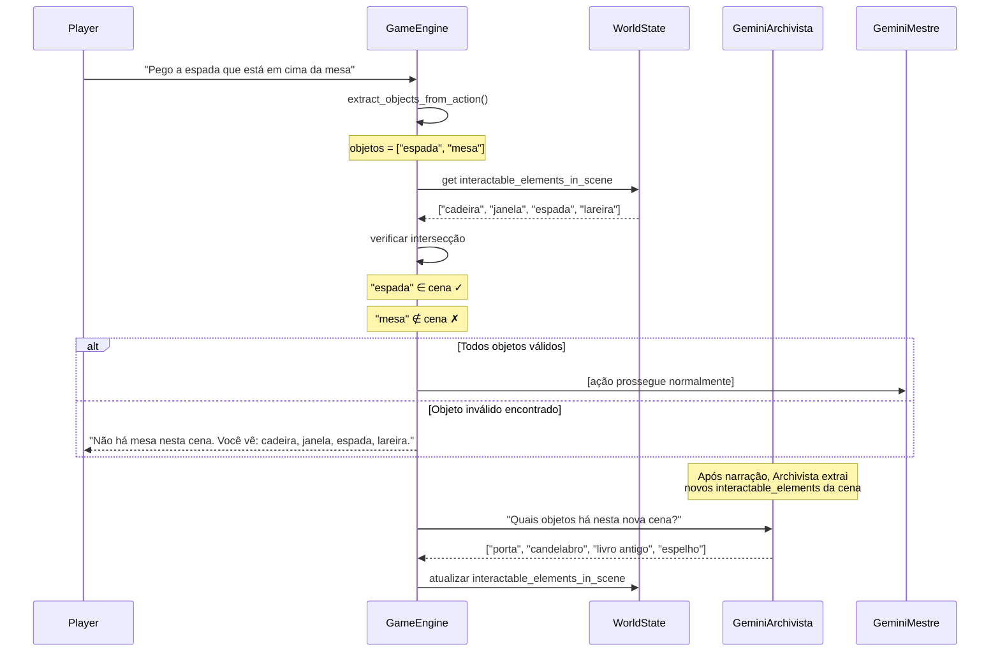
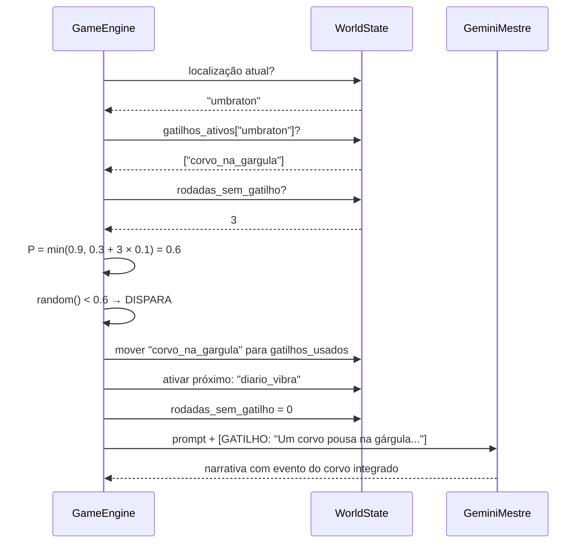
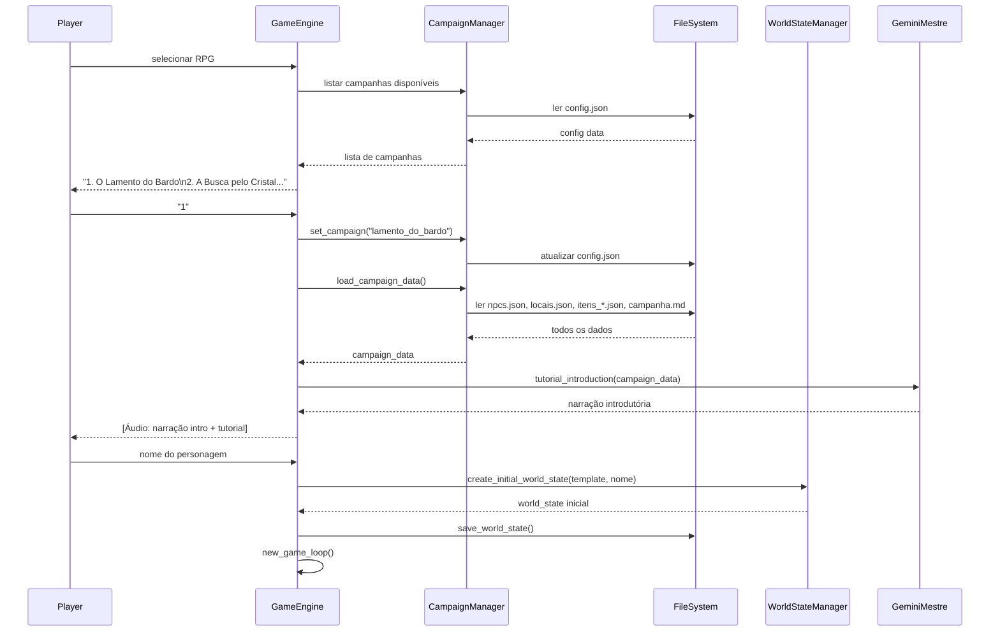

# Diagramas de Sequência

## 1. Inicialização da Plataforma

---

## 2. Fluxo Completo — Turno RPG

---

## 3. Fluxo Completo — Turno Conto Interativo

---

## 4. Sistema TTS com Fallback

---

## 5. Validação Semântica de Ações

---

## 6. Sistema de Gatilhos Narrativos

---

## 7. Seleção e Início de Campanha

