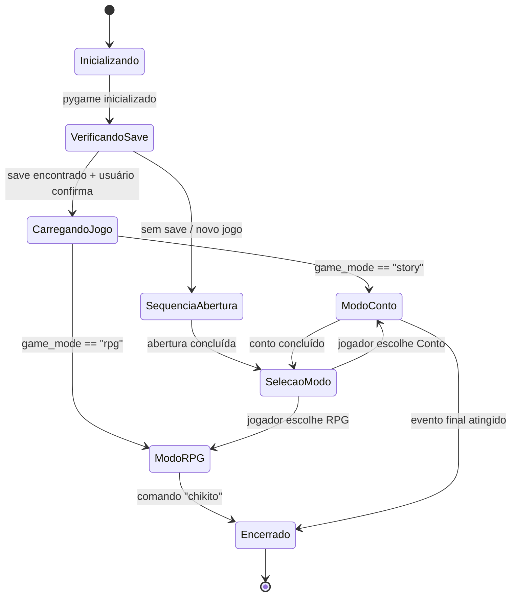
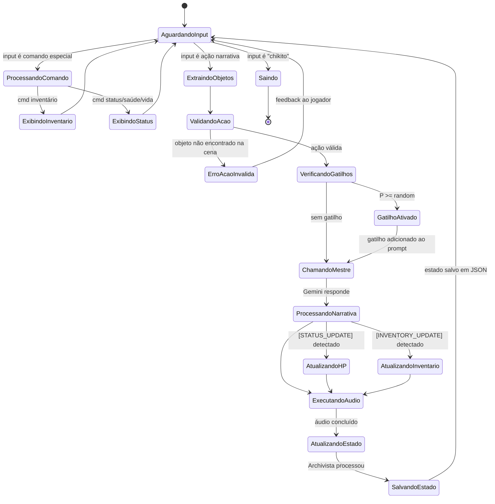
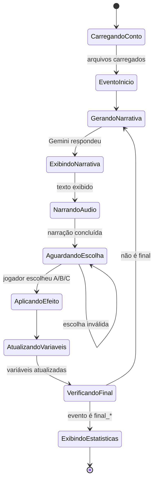
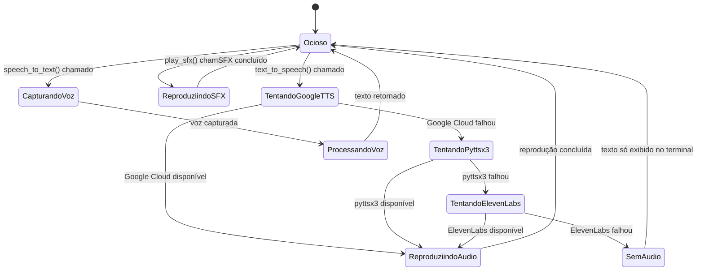
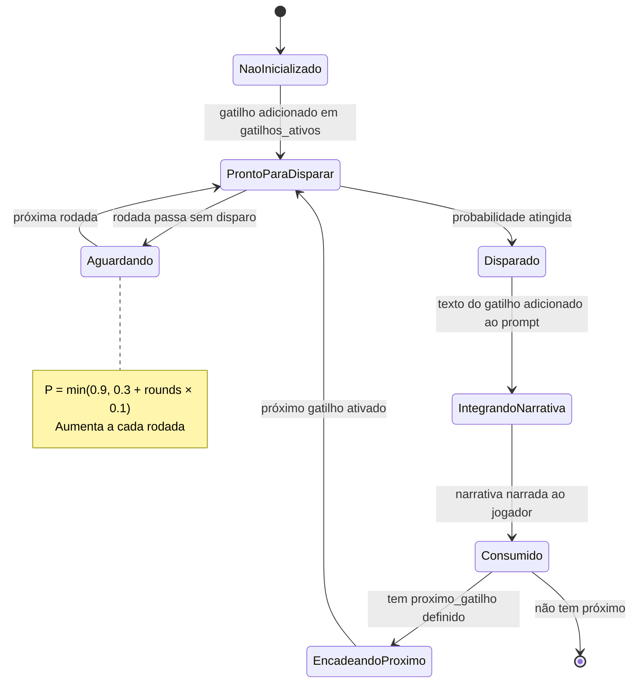
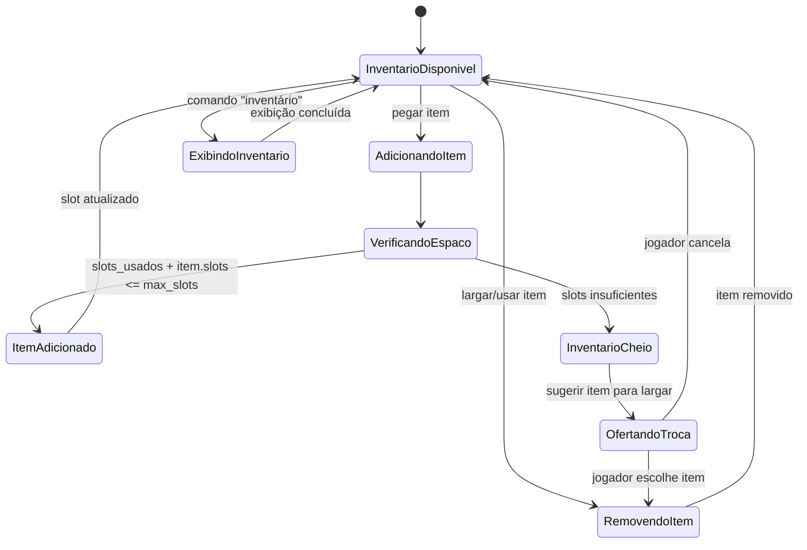
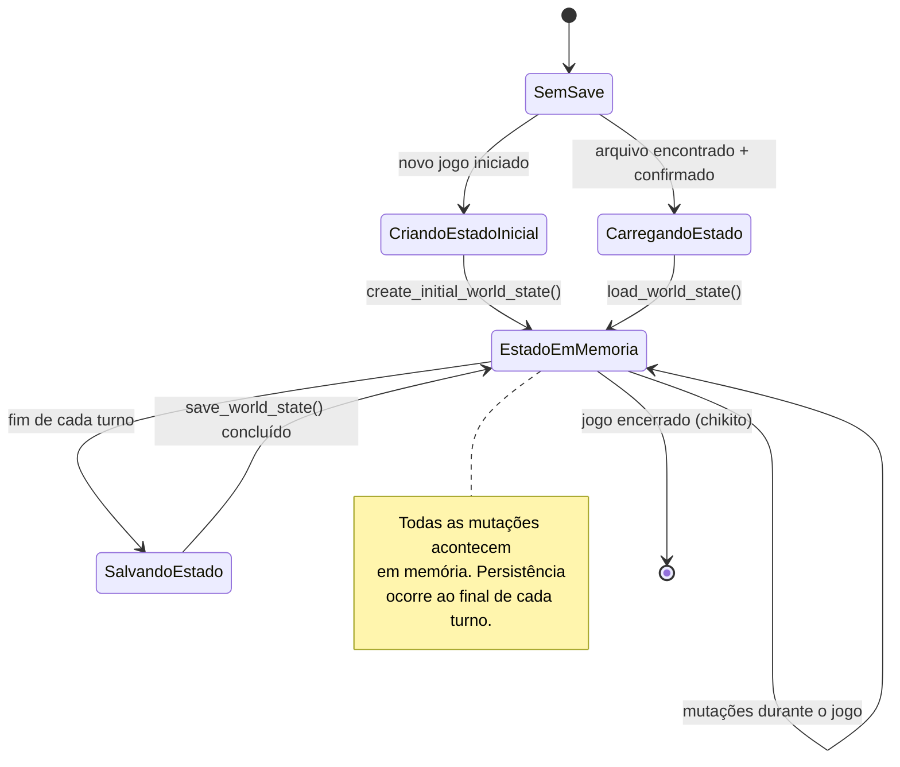

# Diagramas de Estado

## 1. Estado da Plataforma (Geral)

---

## 2. Estado do Loop RPG

---

## 3. Estado do Conto Interativo

---

## 4. Estado do Sistema de Áudio

---

## 5. Estado dos Gatilhos (por Localização)

---

## 6. Estado do Inventário

---

## 7. Estado da Persistência

