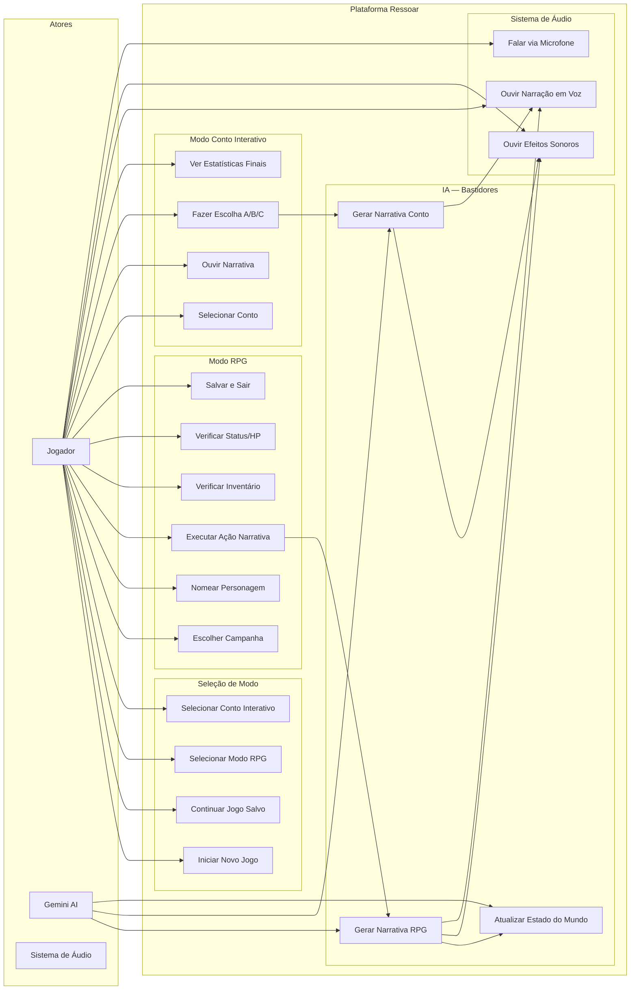

# Diagrama de Casos de Uso

## Visão Geral

---

## Casos de Uso Detalhados

### UC1 — Iniciar Novo Jogo

| Campo        | Descrição                                      |
|--------------|------------------------------------------------|
| **Ator**     | Jogador                                        |
| **Pré-cond.**| Plataforma instalada e configurada             |
| **Fluxo**    | 1. Executar `python game.py`   2. Sem save encontrado   3. Ouvir sequência de abertura   4. Selecionar modo de jogo |
| **Pós-cond.**| Estado inicial criado para o modo escolhido    |

---

### UC2 — Continuar Jogo Salvo

| Campo        | Descrição                                          |
|--------------|----------------------------------------------------|
| **Ator**     | Jogador                                            |
| **Pré-cond.**| `estado_do_mundo.json` presente no diretório       |
| **Fluxo**    | 1. `python game.py` detecta save   2. Pergunta ao jogador se quer continuar   3. Carrega world_state do JSON   4. Retoma no modo/ponto salvo |
| **Pós-cond.**| Jogo continua do estado salvo                      |

---

### UC7 — Executar Ação Narrativa (RPG)

| Campo        | Descrição                                                       |
|--------------|-----------------------------------------------------------------|
| **Ator**     | Jogador, Gemini AI                                              |
| **Pré-cond.**| Jogo RPG em andamento                                           |
| **Fluxo**    | 1. Jogador digita/fala ação   2. Sistema valida objetos mencionados   3. Calcula probabilidade de gatilho   4. Envia prompt para Gemini   5. Recebe narrativa   6. Dispara SFX contextuais   7. Narra em voz   8. Archivista atualiza estado   9. Salva em JSON |
| **Alt. 2a**  | Objeto inválido: exibe mensagem de erro, volta ao input         |
| **Pós-cond.**| Estado atualizado, narrativa narrada, jogo salvo               |

---

### UC13 — Fazer Escolha A/B/C (Conto)

| Campo        | Descrição                                                   |
|--------------|-------------------------------------------------------------|
| **Ator**     | Jogador                                                     |
| **Pré-cond.**| Conto em andamento, evento atual exibido                    |
| **Fluxo**    | 1. Jogador digita A, B ou C   2. Sistema aplica efeitos nas variáveis   3. Avança para próximo evento   4. Verifica se é evento final |
| **Alt.**     | Input inválido: pede novamente                              |
| **Pós-cond.**| Variáveis atualizadas, novo evento carregado                |

---

### UC17 — Falar via Microfone

| Campo        | Descrição                                                        |
|--------------|------------------------------------------------------------------|
| **Ator**     | Jogador                                                          |
| **Pré-cond.**| pyaudio e SpeechRecognition configurados, microfone disponível  |
| **Fluxo**    | 1. Sistema emite chime (pronto para ouvir)   2. Jogador fala   3. Google STT converte para texto   4. Texto processado como entrada normal |
| **Alt.**     | Falha de reconhecimento: solicitar repetição ou usar teclado    |
| **Pós-cond.**| Input de voz convertido em texto e processado normalmente       |

---

### UC20 — Atualizar Estado do Mundo (Archivista)

| Campo        | Descrição                                                           |
|--------------|---------------------------------------------------------------------|
| **Ator**     | Gemini AI (chamado automaticamente pelo sistema)                    |
| **Pré-cond.**| Narrativa do Mestre recebida                                        |
| **Fluxo**    | 1. Sistema envia world_state + narrativa para Gemini Archivista   2. Gemini extrai objetos interativos mencionados   3. Atualiza NPCs na cena   4. Atualiza localização se mudou   5. Adiciona evento ao resumo recente |
| **Pós-cond.**| `interactable_elements_in_scene` atualizado para validação futura  |
